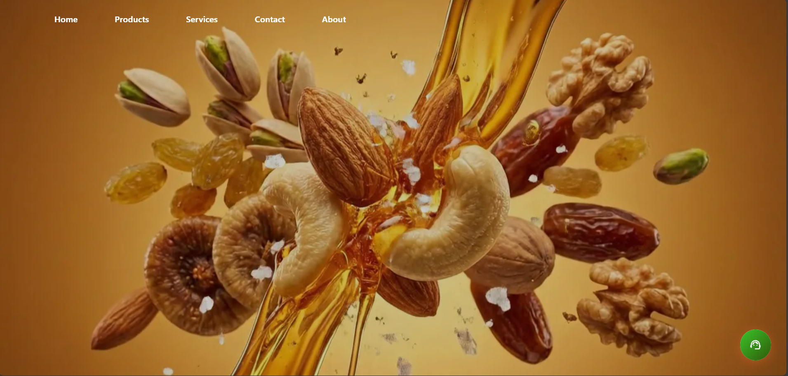
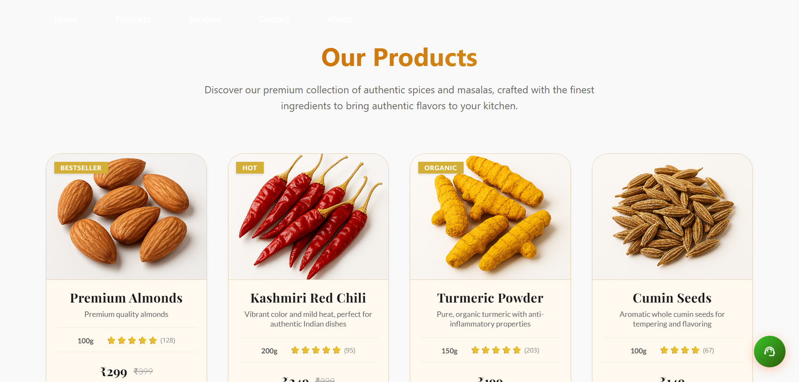
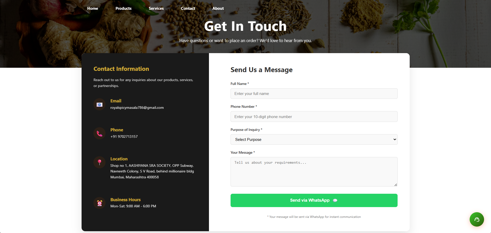

# Royal Spicy Masala 

A modern, responsive e-commerce website for premium spices, groceries, and wholesale distribution services.



## About The Project

Royal Spicy Masala is a premium spice and grocery business offering high-quality Indian spices, dry fruits, grains, and oils. We provide wholesale distribution, custom packaging, and reliable logistics services to retailers and businesses across India.

### Features

- 🏠 **Home** - Hero section with animated brand showcase
- 🛒 **Products** - Premium spices, dry fruits, grains, and oils
- 🏢 **About Us** - Company profile and distribution network
- 🚚 **Services** - Wholesale, packaging, and logistics solutions
- 📱 **Responsive Design** - Works on all devices

### Products Offered

- **Spices** - Haldi, Jeera, Coriander Powder, Biryani Masala, Kashmiri Mirchi
- **Dry Fruits** - Almonds and premium dry fruits
- **Grains** - Quality grains for wholesale
- **Oils** - Cooking oils and edible oils
- **Packaged Spices** - Tata Sampann, MDH, and other premium brands

### Services

- Wholesale Distribution
- Custom Packaging
- Quality Assurance
- Logistics & Delivery
- Pan-India Distribution Network

---

## Screenshots

Add your website screenshots below:

### Home Page


### Products Page


### Services


### Contact


---

## Tech Stack

- **Frontend**: React 18 + Vite
- **Styling**: CSS3
- **Animations**: Custom animations
- **Deployment**: Ready for GitHub Pages, Netlify, Vercel

---

## Getting Started

### Prerequisites

- Node.js (v14 or higher)
- npm or yarn

### Installation

```
bash
# Clone the repository
git clone https://github.com/yourusername/RoyalSpicyMasala.git

# Navigate to the project directory
cd RoyalSpicyMasala

# Install dependencies
npm install

# Start development server
npm run dev
```

### Build for Production

```
bash
npm run build
```

---

## Project Structure

```
RoyalSpicyMasala/
├── public/
│   ├── AboutSectionImg/      # About section images
│   ├── BrandLogo/           # Brand partner logos
│   ├── Heroimg/             # Hero section images
│   ├── OurServicesImg/      # Services section images
│   ├── productsImg/         # Product images
│   ├── screenshots/         # Screenshot placeholders
│   └── webpHero/            # WebP hero images
├── src/
│   ├── assets/              # Static assets
│   ├── components/          # React components
│   ├── common/              # Common utilities
│   ├── App.css              # Main styles
│   ├── App.jsx              # Main app component
│   ├── index.css            # Global styles
│   └── main.jsx             # Entry point
├── index.html
├── package.json
├── vite.config.js
└── README.md
```

---

## Contributing

1. Fork the repository
2. Create your feature branch (`git checkout -b feature/AmazingFeature`)
3. Commit your changes (`git commit -m 'Add some AmazingFeature'`)
4. Push to the branch (`git push origin feature/AmazingFeature`)
5. Open a Pull Request

---

## License

Distributed under the MIT License.

---

## Contact

📍 **Royal Spicy Masala**
- Location: India
- Email: contact@royalspicymasala.com

---

*Add your screenshots to the `public/screenshots/` folder and update this README!*
